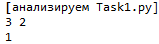
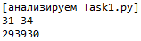
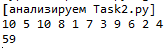
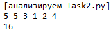
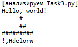
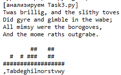

# Знакомство с REACT
___________________________________________________
## Лабораторная работа №12
***Глазков М.С. [АСБ-3-036]***
___________________________________________________


## Task 1
<details>
<summary></summary>

Дана прямоугольная доска $N*M$ (**N** строк и **M** столбцов).  
В левом верхнем углу находится шахматный конь Олег, которого необходимо переместить в правый нижний угол доски. 
В данной задаче конь может перемещаться на две клетки вниз и одну клетку вправо или на одну клетку вниз и две клетки вправо.

Необходимо определить, сколько существует различных маршрутов, ведущих из левого верхнего в правый нижний угол.

**Формат входных данных**  
Входной файл содержит два натуральных числа `N` и `M` $(1 \leq N, M \leq 50)$.

**Формат выходных данных**  
В выходной файл выведите единственное число — количество способов добраться конём до правого нижнего угла доски.

### Эталонное решение
Состоит из 12 строк кода и имеет алгоритмическую сложность $O(N * M)$

**Примеры ввода и вывода:**  
<table>
<tr><th>Ввод</th><th>Вывод</th></tr>
<tr>
  <td>

```
3 2
```

</td>
  <td> 

```
1
```

  </td>
</tr>
<tr>
  <td>

```
31 34
```

  </td>
  <td>

```
293930
```

  </td>

</tr>
</table>

#### Код
```python
def count_horse_paths(board_width: int, board_height: int):
    field = [[0 for _ in range(0, width)] for _ in range(0, height)]
    field[0][0] = 1
    for i in range(0, board_height):
        for j in range(0, board_width):
            for move_x, move_y in [(-1, -2), (-2, -1)]:
                field[i][j] += field[i + move_y][j + move_x] if (0 <= i + move_y < board_height) and (0 <= j + move_x < board_width) else 0
    return field[board_height - 1][board_width - 1]

if __name__ == '__main__':
    width, height = map(int, input().split())
    print(count_horse_paths(width, height))
```

</details>

**Результат:**




___________________________________________________


## Task 2
<details>
<summary></summary>

Олег очень любит занятия по программированию в университете. 
А еще больше он любит узнавать новые алгоритмы и структуры данных.
Для того, чтобы ему не было скучно на очередном занятии, преподаватель предложил придумать способ поиска медианы для последовательности 
**X** из **n** элементов.
Олег быстро нашел в сети нужный алгоритм и отчитался перед учителем. Тогда тот предложил усложнённую версию задачи: для каждого 
**i** от **1** до **n** нужно найти медиану среди первых **i** элементов последовательности 
**X**. В качестве результата преподаватель попросил сказать сумму найденных значений.

Медианой последовательности в случае нечётной длины **L** называется элемент, который будет равноудалён от концов последовательности, если ее отсортировать по возрастанию или убыванию 
(нетрудно сообразить, что этот элемент имеет номер $(L + 1) / 2$ в отсортированной последовательности, если номера считать с единицы). 
В случае чётной длины **L** медианой будем считать элемент, который окажется на месте $L/2$, если последовательность отсортировать по возрастанию.

**Формат входных данных**  
В первой строке входных данных записано число `N` $(1 \leq N \leq 100000)$. Во второй строке записаны `N` различных чисел $X_i(1 \leq X_i \leq 10^9)$

**Формат выходных данных**  
Выведите сумму найденных медианных значений.

### Эталонное решение  
Состоит из 19 строк кода и имеет алгоритмическую сложность $O(N * \log{N})$

<table>
<tr><th>Ввод</th><th>Вывод</th></tr>
<tr>
  <td>

```
10
5 10 8 1 7 3 9 6 2 4
```

</td>
  <td> 

```
59
```

  </td>
</tr>
<tr>
  <td>

```
5
5 3 1 2 4
```

  </td>
  <td>

```
16
```

  </td>

</tr>
</table>

#### Код
```python
from heapq import heappop, heappush

def subarrays_medians_sum(numbers: list):
    medians_sum = 0
    smallerHalf, largerHalf = [], []
    for number in numbers:
        heappush(smallerHalf, -number)
        heappush(largerHalf, -heappop(smallerHalf)) 
        if len(smallerHalf) < len(largerHalf):
            heappush(smallerHalf, -heappop(largerHalf))
        medians_sum += -smallerHalf[0]
    return medians_sum

if __name__ == '__main__':
    numbers = [int(number) for number in input().split()][1:]
    print(subarrays_medians_sum(numbers))
```

</details>

**Результат:**




___________________________________________________

## Task 3
<details>
<summary></summary>

Вовочка ломает систему безопасности Пентагона. 
Для этого ему понадобилось узнать, какие символы в секретных зашифрованных посланиях употребляются чаще других. 
Для удобства изучения Вовочка хочет получить графическое представление встречаемости символов. 
Поэтому он хочет построить гистограмму количества символов в сообщении. 
Гистограмма — это график, в котором каждому символу, встречающемуся в сообщении хотя бы один раз, соответствует столбик, 
высота которого пропорциональна количеству этих символов в сообщении.


**Формат входных данных**  
Входной файл содержит зашифрованный текст сообщения. 
Он содержит строчные и прописные латинские буквы, цифры, знаки препинания («.», «!», «?», «:», «-», «,», «;», «(», «)»), 
пробелы и переводы строк. Размер входного файла не превышает 10000 байт. 
Текст содержит хотя бы один непробельный символ. Все строки входного файла не длиннее 200 символов.
Для каждого символа c кроме пробелов и переводов строк выведите столбик из символов «#», количество которых должно быть равно количеству символов c в данном тексте. 
Под каждым столбиком напишите символ, соответствующий ему. Отформатируйте гистограмму так, чтобы нижние концы столбиков были на одной строке, первая строка 
и первый столбец были непустыми. Не отделяйте столбики друг от друга. Отсортируйте столбики в порядке увеличения кодов символов.

**Формат выходных данных**  
Для каждого символа c кроме пробелов и переводов строк выведите столбик из символов «#», 
количество которых должно быть равно количеству символов c в данном тексте. Под каждым столбиком напишите символ, соответствующий ему. 
Отформатируйте гистограмму так, чтобы нижние концы столбиков были на одной строке, первая строка и первый столбец были непустыми. 
Не отделяйте столбики друг от друга. Отсортируйте столбики в порядке увеличения кодов символов.

### Эталонное решение  
Состоит из 25 строк кода и имеет алгоритмическую сложность $O(N * \log{N})$

<table>
<tr><th>Ввод</th><th>Вывод</th></tr>
<tr>
  <td>

```
Hello, world!

```

</td>
  <td> 

```
     #   
     ##  
#########
!,Hdelorw

```

  </td>
</tr>
<tr>
  <td>

```
Twas brillig, and the slithy toves
Did gyre and gimble in the wabe;
All mimsy were the borogoves,
And the mome raths outgrabe.

```

  </td>
  <td>

```
         #              
         #              
         #              
         #              
         #              
         #         #    
         #  #      #    
      #  # ###  ####    
      ## ###### ####    
      ##############    
      ##############  ##
#  #  ############## ###
########################
,.;ADTabdeghilmnorstuvwy

```

  </td>

</tr>
</table>

#### Код
```python
def to_characters_histogram(text: str):
    chars = {}
    for char in filter(lambda char: not char.isspace(), text):
        chars.update({char : chars.get(char, 0) + 1})
    sorted_columns = sorted(chars.items())
    max_height = max(chars.values())
    sorted_text_columsn = "\n".join("".join(["#" if height <= column[1] else " " for column in sorted_columns]) for height in range(max_height, 0, -1))
    return sorted_text_columsn + "\n" + "".join([column[0] for column in sorted_columns])

if __name__ == '__main__':
    text = input()
    print(to_characters_histogram(text))
```

</details>

**Результат:**





___________________________________________________